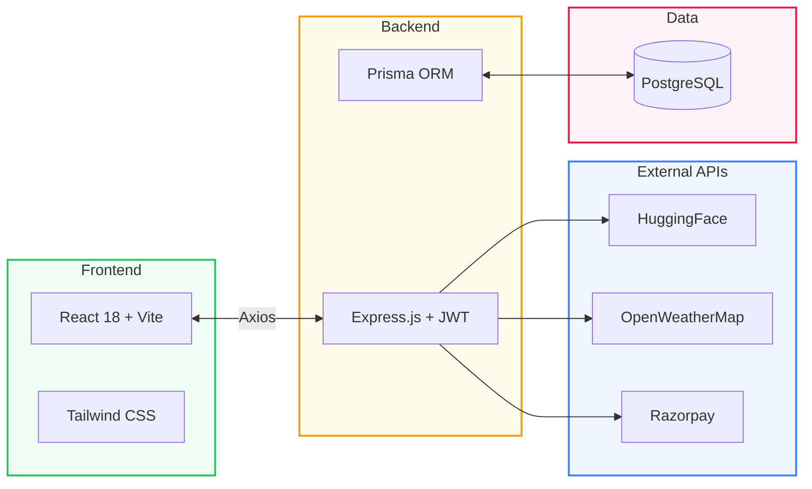

<div align="center">


<br/><br/>

<a href="https://github.com/"></a>
<a href="https://github.com/"></a>
<a href="https://img.shields.io/badge/"></a>
<a href="https://github.com/"></a>
<a href="https://github.com/"></a>
<a href="https://github.com/"></a>

<br/><br/>

<h1>AgriConnect</h1>

<h3><i>Smart Farming for Modern India</i></h3>

<b>AI Crop Diagnostics</b> · <b>Equipment Rental</b> · <b>Weather Advisory</b>

<br/>

<i>Empowering 78M+ Indian smallholder farmers through accessible technology.</i>

<br/><br/>

<a href="#-key-features"></a>
<a href="#-quick-start"></a>
<a href="#-architecture"></a>

</div>

---

## The Problem

> **70% of Indian farmers** are smallholders (under 2 hectares) who lack:
>
> - Timely crop disease diagnosis — losing **15–30% yield** annually
> - Affordable farm equipment — tractor rentals cost **₹800–1,500/hr**
> - Hyperlocal, actionable weather intelligence
>
> **AgriConnect bridges all three gaps in one platform.**

---

## Key Features

<table>
<tr>
<td width="33%" valign="top">

### AI Crop Disease Detection

```
Upload Leaf Photo
       ↓
HuggingFace Vision AI
       ↓
Disease + Confidence
       ↓
Treatment (EN + Tamil)
```

- Instant diagnosis via HF Inference API
- Confidence scoring with breakdown
- Bilingual: English & Tamil
- Organic & chemical remedies

</td>
<td width="33%" valign="top">

### Equipment Rental

```
Farmer needs tractor
       ↓
Browse local listings
       ↓
Razorpay (Test Mode)
       ↓
Booking Confirmed
```

- P2P "Airbnb for Agriculture"
- Tractors, harvesters, pumps
- Hourly & daily pricing
- Razorpay test-mode payments

</td>
<td width="33%" valign="top">

### Weather Crop Advisory

```
Select TN District
       ↓
Real-time Weather
       ↓
Threshold Analysis
       ↓
Automated Crop Advice
```

- Hyperlocal via OpenWeatherMap
- 5 Tamil Nadu farming districts
- Temp, rain, humidity alerts
- Crop recommendation engine

</td>
</tr>
</table>

---

## Architecture



---

## Project Structure

<details>
<summary><b>Click to expand directory tree</b></summary>

```
AgriConnect/
├── backend/
│   ├── controllers/
│   ├── middleware/
│   ├── models/
│   ├── routes/
│   ├── services/
│   ├── index.js
│   └── package.json
├── frontend/
│   ├── public/
│   ├── src/
│   │   ├── components/
│   │   ├── pages/
│   │   ├── hooks/
│   │   ├── context/
│   │   └── services/
│   ├── tailwind.config.js
│   ├── vite.config.js
│   └── package.json
├── database/
│   └── seed.sql
├── docs/
│   ├── ARCHITECTURE.md
│   ├── API.md
│   ├── DEPLOYMENT.md
│   └── SCREENSHOTS.md
└── README.md
```

</details>

---

## Tech Stack

| Layer | Technologies |
|-------|-------------|
| **Frontend** | `React 18` `Vite` `Tailwind CSS` `React Router v6` `React Query` `Axios` `Lucide Icons` |
| **Backend** | `Node.js 18` `Express.js` `JWT` `bcrypt` `Multer` `Helmet` `Rate Limiter` |
| **Database** | `PostgreSQL` (Neon) `Prisma ORM` |
| **AI / APIs** | `HuggingFace Inference` `OpenWeatherMap` `Cloudinary` `Razorpay` (test) |
| **Deploy** | `Vercel` (frontend) `Railway` (backend) |

---

## Quick Start

 &nbsp;
 &nbsp;


<details>
<summary><b>Required API Keys</b></summary>

| Key | Service |
|-----|---------|
| `DATABASE_URL` | PostgreSQL / Neon |
| `JWT_SECRET` | Token signing |
| `CLOUDINARY_CLOUD_NAME` | Media storage |
| `CLOUDINARY_API_KEY` | Cloudinary auth |
| `CLOUDINARY_API_SECRET` | Cloudinary auth |
| `HUGGINGFACE_API_KEY` | Vision model |
| `OPENWEATHERMAP_API_KEY` | Weather data |
| `RAZORPAY_KEY_ID` | Payments (test) |
| `RAZORPAY_KEY_SECRET` | Payments (test) |

</details>

### 1. Backend

```bash
git clone https://github.com/<your-org>/AgriConnect.git
cd AgriConnect/backend
npm install
cp .env.example .env
# Fill in API keys in .env
npx prisma generate
npx prisma db push
npm run dev
```

### 2. Seed Database

```bash
psql -d $DATABASE_URL -f ../database/seed.sql
```

> Loads Tamil Nadu districts, crop data, equipment catalog, and weather thresholds.

### 3. Frontend

```bash
cd ../frontend
npm install
cp .env.example .env
npm run dev
```

| Service | Port |
|---------|------|
| Backend | `:5000` |
| Frontend | `:3000` |

---

## Tamil Nadu Coverage

| District | Key Crops | Weather Focus |
|----------|-----------|---------------|
| **Coimbatore** | Cotton, Maize, Turmeric | Temperature & humidity |
| **Karur** | Banana, Sugarcane, Rice | Rainfall patterns |
| **Salem** | Mango, Tapioca, Cotton | Heat stress monitoring |
| **Madurai** | Paddy, Chilli, Banana | Monsoon tracking |
| **Thanjavur** | Rice, Pulses | Flood & drought alerts |

---

## Documentation

| Doc | Description |
|-----|-------------|
| [Architecture](docs/ARCHITECTURE.md) | System design & data flow |
| [API Specs](docs/API.md) | REST endpoints with examples |
| [Deployment](docs/DEPLOYMENT.md) | Vercel + Railway guide |
| [UI Specs](docs/SCREENSHOTS.md) | Mockups & user flows |

---

<div align="center">


</div>
